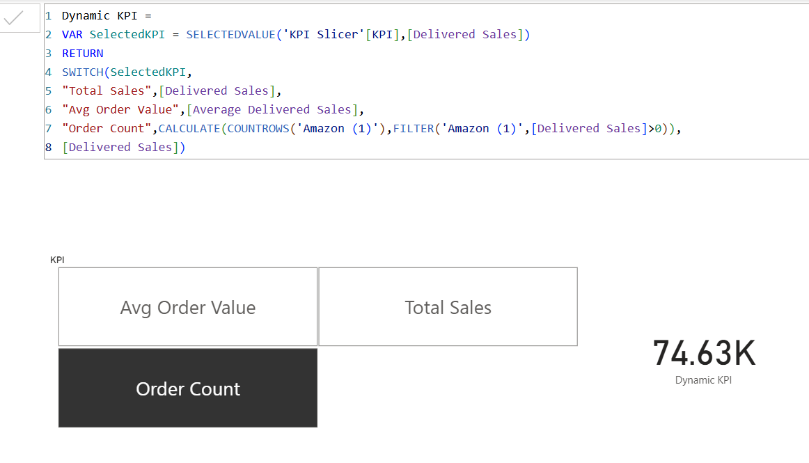

# BFSI Data Analytics Portfolio

## Daily Progress
| Date | Task | Status | GitHub Commit |
|------|------|--------|---------------|
| 2026-01-27 | WiseOwl DAX Videos 1-2 | Completed ✅ | [feat: KPI slicer] |
| 2026-01-28 | Day 3 Production DAX | Completed ✅ | Page 3 Combo Chart |

## DAX Learning Journey
**Video 2 - Disconnected KPI Slicer**

**KPI_Slicer Table:**
| KPI |
|-----|
| Total Sales |
| Avg Order Value |
| Delivered Orders |

**Dynamic KPI Measure:**

**Key Features Added**
• Dynamic KPI slicer switches metrics instantly
• Production profit calc + brand combo chart
• Active products (delivered orders > 0 filter)

([folder-name/Profit and Delivered Sales by Brand.png)](https://github.com/jiteshraizada/power-bi-dashboards/blob/33e70c14f109b06e305da58b825a84780065a54b/folder-name/Profit%20and%20Delivered%20Sales%20by%20Brand.png)
